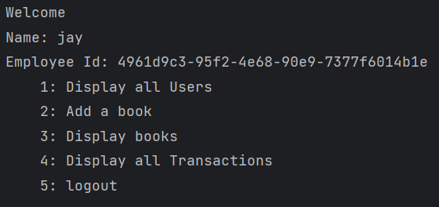

<h1>330 Library Management System Terminal Version</h1>

330 Library Management System is a software application and platform designed to automate and streamline various tasks and processes involved in managing a library's resources. Its primary purpose is to efficiently organize, catalog, circulate, and track library materials while providing easy access to library users.

The terminal version of this program was written as a foundation for the GUI version of this application which can be accessed <a href = ">https://github.com/JMyoi/330LibraryManagementSystem_GUI_Version">HERE</a>

Both versions of this project were written in the IntelliJ IDEA

The terminal version of this program is a menu-type interface where the user selects the number to its respective options.

<h2>User Stories</h2>
As a User
<ul>
  <li> As a user, I want to be able to create a new account
</li>
  <li> As a user, I want to be able to log out.
</li>
</ul>
As a Member
<ul>
  <li>As a Member, I want to see the books I have borrowed</li>
    <li>As a Member, I want a user interface to view and borrow books.</li>
  <li>As a Member, I want to be able to remove a book I have borrowed</li>

</ul>
As a Librarian
<ul>
  <li>As a librarian, I want to see all the books in the library and their
information.</li>
  <li>As a librarian, I want to be able to view all the transactions from the
members.</li>
  <li>As a librarian, I want to be able to add a new book to the library.</li>
  <li>As a Librarian, I want to be able to view all the users in the library.
This project is for CSC330 - Object-Oriented Software Design as the final project of the class.</li>
</ul>

<h3>Adversity; Learning JavaFX First: A Lesson in Efficiency</h3>

While the terminal version of the application provided a solid foundation, devoting time to its
completion may have been an inefficient use of time. The transition from terminal to GUI
unexpectedly proved to be a complex, confusing, and challenging endeavor, requiring
extensive rework and adaptation. In retrospect, it would have been more time-effective to
prioritize JavaFX learning alongside the application's development.

Contributors and their roles

<ul>
  <li>Jay Chen - Developer</li>
  <li>Joshi Joseph - QA</li>
  <li>Brain LaBarbera - Manager/TechLead</li>
</ul>
